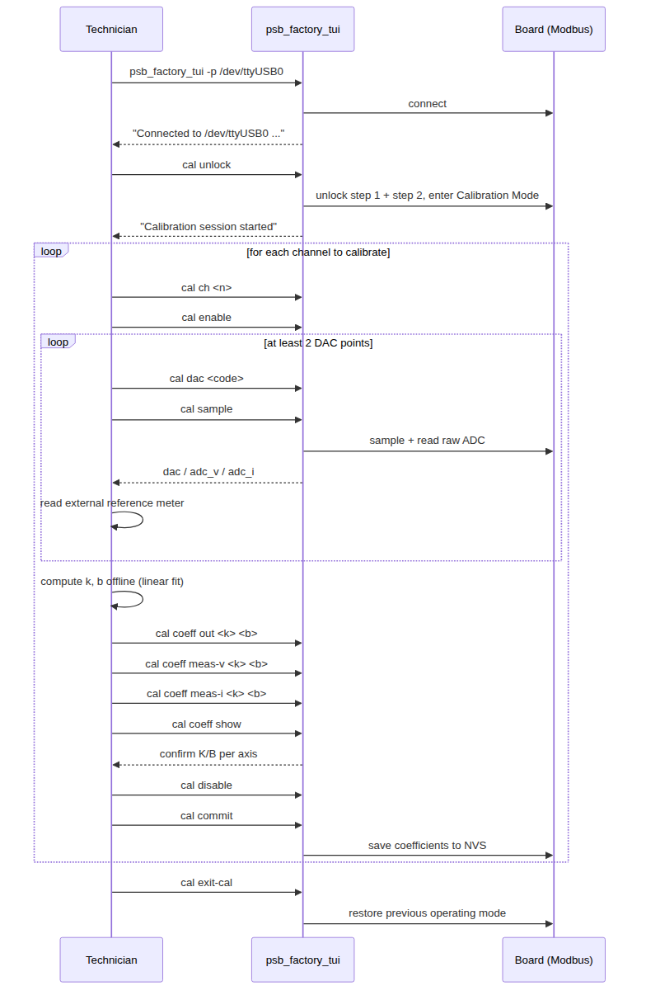
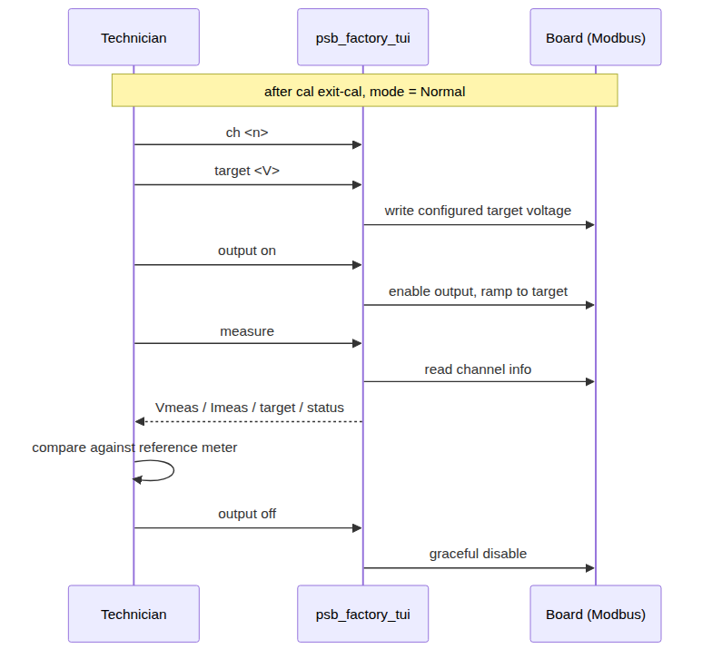

# Factory Calibration Guide — psb_factory_tui

Quick-start reference for calibrating a Jianwei voltage-control board using
the **factory TUI** (`psb_factory_tui`), the host-side tool intended for
production/technician use. The Qt factory GUI exists in this repo but is not
yet release-ready — use the TUI described here.

*(中文版本: [calibration-guide.zh.md](calibration-guide.zh.md))*

---

## 1. What calibration does

Each channel converts raw hardware codes to physical units through a linear
coefficient triple, `y = x × k × 10^exp + b`, on three independent axes:

| Axis | Coefficient fields | Meaning |
|---|---|---|
| Output | `out_cal_k` / `out_cal_k_exp` / `out_cal_b` | `raw_dac = target × k × 10^exp + b` |
| Voltage measurement | `v_cal_k` / `v_cal_k_exp` / `v_cal_b` | `measured_v = raw_adc_v × k × 10^exp + b` |
| Current measurement | `i_cal_k` / `i_cal_k_exp` / `i_cal_b` | `measured_i = raw_adc_i × k × 10^exp + b` |

`k` is a `uint16_t` mantissa (1–65535); `exp` is an `int16_t` decimal exponent
in the range **-9 to 4**; `b` is an `int16_t` offset, unchanged from before.
Gain is `k × 10^exp` — this is a decimal floating-point representation, not a
fixed divisor, so the same field can express both a sub-unity attenuating
front-end (jw_hvb's measurement axes, gain ≈ 0.001–0.015) and a super-unity
amplifying one (a board with no divider ahead of the ADC, or a low-voltage-max
output stage needing more DAC-code resolution per volt than a 2000V board
does). See `docs/guide/parameter-reference.md` for the full derivation,
including why `exp` exists (a fixed single divisor per axis couldn't cover
both directions in a `uint16_t`).

Each axis's default `exp` reproduces the pre-v3.1 fixed-divisor formula
exactly: `-4` for output (was `/10000`), `-6` for both measurement axes (was
`/1000000`). If you're calibrating a board whose default `exp` values were
never touched, you can ignore `exp` entirely and follow this guide exactly as
you would have before — nothing about the two-point-fit workflow in §5-§6
changes unless a channel's gain falls outside what the legacy divisor could
reach.

**Factory (pre-calibration) defaults** — the board ships with these; your job
is to replace them with real per-unit numbers:

| Field | Default | Note |
|---|---|---|
| `out_cal_k` / `out_cal_k_exp` / `out_cal_b` | 32768 / -4 / 0 | Nominal 1:1-ish DAC gain, uncalibrated |
| `v_cal_k` / `v_cal_k_exp` / `v_cal_b` | 1 / -6 / 0 (jw_hvb: 2387 / -6 / 0) | Deliberately near-zero until calibrated |
| `i_cal_k` / `i_cal_k_exp` / `i_cal_b` | 1 / -6 / 0 (jw_hvb: 14901 / -6 / 0) | Deliberately near-zero until calibrated |

---

## 2. What you need

- Board powered and connected via USB-serial Modbus RTU adapter (e.g.
  `/dev/ttyUSB0`, 115200 8N1, slave id 1 — all defaults).
- `psb_factory_tui` built and available (see §3).
- A calibrated external reference: a DMM for the voltage axis, a reference
  current source or precision load for the current axis. The board's own
  ADC readings are what you're calibrating — don't use them as ground truth.
- Calibrate one channel at a time; the firmware only allows one channel's
  calibration output active at once.

---

## 3. Build and launch

```bash
cmake -S tools -B tools/build       # BUILD_FACTORY is ON by default
cmake --build tools/build --target psb_factory_tui -j
tools/bin/psb_factory_tui -p /dev/ttyUSB0
```

```
Usage: psb_factory_tui -p <port> [-b <baud>] [-i <slaveId>]
  -p, --port   Serial port to connect to (required, e.g. /dev/ttyUSB0)
  -b, --baud   Baud rate (default 115200)
  -i, --id     Modbus slave id (default 1)
```

The connection is established once at startup. There's no `connect` command
inside the tool — if the port or wiring is wrong, fix it and relaunch. To
leave the session, type `exit` (or `quit`); there's no `disconnect` either,
since a dropped session can't reconnect from inside the REPL.

---

## 4. Command reference

Commands are used at the `factory>` prompt after launch.

### Root-level (works in any operating mode)

| Command | Effect |
|---|---|
| `info` | Protocol/firmware/variant/mode/uptime summary |
| `ch <n>` | Select the active channel (shared by all per-channel commands below) |
| `target <V>` | Set configured target voltage on the active channel |
| `output on\|off\|immed\|zero` | Enable / graceful-disable / immediate-disable / force-zero |
| `fault clear\|clear-history` | Clear active fault block / clear fault history |
| `measure` | Read Vmeas, Imeas, target, status on the active channel |
| `sys status` | Mode + per-channel one-line overview |
| `sys mode normal\|auto` | Set operating mode |
| `sys save` / `sys load` | Save / load all configuration (op-config + cal) to/from NVS |
| `sys factory-reset` | Reset all configuration to firmware defaults |
| `sys reset` | Software reset the board, then disconnect |

### Calibration submenu (`cal ...`, requires unlock)

| Command | Effect |
|---|---|
| `cal unlock` | Two-step unlock + enter Calibration Mode (atomic) |
| `cal ch <n>` | Select active channel (same selector as root `ch`) |
| `cal enable` / `cal disable` | Enable calibration output / disable + zero DAC |
| `cal dac <code>` | Write raw DAC code (0–65535, or lower if fixture-limited) |
| `cal sample` | Trigger a fresh sample, print `dac` / `adc_v` / `adc_i` |
| `cal read` | Print the last snapshot without triggering a new sample |
| `cal coeff out\|meas-v\|meas-i <k> <b>` | Write a coefficient pair, leaving `exp` untouched |
| `cal coeff out\|meas-v\|meas-i <k> <b> <exp>` | Write `k`, `b`, and the decimal exponent together |
| `cal coeff show` | Print current coefficients for the active channel |
| `cal commit` | Persist the active channel's coefficients to NVS |
| `cal status` | Mode + per-channel output/dac/adc overview |
| `cal safe` | Disable calibration output and zero DAC on **all** channels |
| `cal watch adc\|measure\|status\|all [interval]` | Live-updating monitor; any key stops it |
| `cal exit-cal` | Exit Calibration Mode, restore the previous operating mode |

---

## 5. Calibration session walkthrough



1. **Unlock**: `cal unlock` — two-step unlock and entry happen as one atomic
   command; the tool prints a short in-session command summary on success.
2. **Per channel**, repeat:
   - `cal ch <n>` to select it, then `cal enable` to energize the output.
   - For at least two DAC codes (more points give a better fit): `cal dac
     <code>`, then `cal sample` to trigger and print the raw readings. Record
     the external reference meter's reading alongside each sample.
   - Compute `k` (and `exp`, if the fitted gain doesn't fit under the
     channel's current `exp`) and `b` per axis offline (spreadsheet, script —
     see §6).
   - Write them back: `cal coeff out <k> <b>`, `cal coeff meas-v <k> <b>`,
     `cal coeff meas-i <k> <b>` (leaves `exp` at its current value), or
     `cal coeff out <k> <b> <exp>` etc. if `exp` also needs to change.
     Confirm with `cal coeff show`.
   - `cal disable` (required before commit — commit is rejected while output
     is enabled or the DAC code is non-zero), then `cal commit`.
3. **Exit**: `cal exit-cal` returns to the operating mode that was active
   before you entered calibration.

---

## 6. Worked example: computing k, exp, and b

All three axes use the same two-point linear fit. Given two `(x, y)` pairs,
where `x` is what the tool reports and `y` is your reference measurement,
converted to the register's raw units, and letting `D = 10^(-exp)` (the
channel's *current* `exp` — normally its factory default, `-4` for output and
`-6` for both measurement axes, unless you've deliberately changed it):

```
k = D × (y2 − y1) / (x2 − x1)
b = y1 − x1 × k / D
```

This is exactly the pre-v3.1 formula, with `D` now derived from `exp` instead
of hardcoded — if you're using each axis's default `exp`, the arithmetic and
the resulting `k`/`b` values are identical to before.

**If the fitted `k` doesn't land in `1..65535`** (out of `uint16_t` range),
`exp` needs to change: pick a new `exp` so `k` lands roughly in `10000..65535`
(a few significant digits of precision), i.e. `exp_new ≈ exp_old +
floor(log10(k_old / 60000))`, then recompute `k = D_new × (y2 − y1) / (x2 −
x1)` with `D_new = 10^(-exp_new)`. This is the case that motivated `exp`
existing at all — a board whose gain the legacy fixed divisor couldn't reach
(e.g. a super-unity measurement front-end, or an output stage needing much
more DAC-code resolution per volt than a 2000V board does).

Round `k`, `exp`, and `b` to integers before writing them back (`k` is
`uint16_t`, `exp` is `int16_t` in range -9..4, `b` is `int16_t`).

**Output axis worked example** (`x` = commanded DAC code, `y` = DMM-measured
output voltage, converted to raw target units at 0.1 V/LSB):

| Point | DAC code (x) | DMM reading | y (raw, ×0.1 V) |
|---|---|---|---|
| 1 | 32768 | 995.0 V | 9950 |
| 2 | 49152 | 1490.0 V | 14900 |

```
k = 10000 × (49152 − 32768) / (14900 − 9950) = 10000 × 16384 / 4950 ≈ 33108
b = 32768 − 9950 × 33108 / 10000 ≈ −174
```

`k` fits comfortably in `uint16_t` at the output axis's default `exp = -4`
(`D = 10000`), so there's nothing to adjust — write it with the 3-arg form:

→ `cal coeff out 33108 -174`

**Voltage-measurement axis worked example** (`x` = `adc_v` from `cal sample`,
`y` = the same DMM readings as above, in raw units):

| Point | adc_v (x) | y (raw, ×0.1 V) |
|---|---|---|
| 1 | 4,140,000 | 9950 |
| 2 | 6,205,000 | 14900 |

```
k = 1000000 × (14900 − 9950) / (6205000 − 4140000) ≈ 2397
b = 9950 − 4140000 × 2397 / 1000000 ≈ 26
```

Fits at the measurement axes' default `exp = -6` (`D = 1000000`) — 3-arg form:

→ `cal coeff meas-v 2397 26`

If this channel instead had a super-unity front-end (no attenuating divider)
and the fit came out to, say, `k ≈ 2,397,000` (out of range at `exp = -6`),
you'd raise `exp` to `-3` and recompute with `D = 1000` instead, landing `k`
back in range — then write both together: `cal coeff meas-v <k> <b> -3`.

**Current-measurement axis worked example** (`x` = `adc_i` from `cal sample`,
`y` = reference current source reading, in raw units at 0.1 nA/LSB):

| Point | adc_i (x) | Reference | y (raw, ×0.1 nA) |
|---|---|---|---|
| 1 | 335,000 | 500.0 nA | 5000 |
| 2 | 1,342,000 | 2000.0 nA | 20000 |

```
k = 1000000 × (20000 − 5000) / (1342000 − 335000) ≈ 14896
b = 5000 − 335000 × 14896 / 1000000 ≈ 10
```

Fits at the default `exp = -6` — 3-arg form:

→ `cal coeff meas-i 14896 10`

**The numbers above are illustrative** — substitute your fixture's actual
`cal sample` output and reference-meter readings. Note how close the fitted
`k` values land to the jw_hvb board's factory defaults (2387, 14901) —
that's expected; a healthy board needs only a small correction, not a wildly
different gain. A board with a different front-end topology (no attenuating
divider ahead of the ADC) would fit a `k` far outside that range and need a
different `exp`, per the note above.

---

## 7. Post-calibration verification

After committing and exiting calibration mode, verify the result using the
root-level commands (no unlock needed):



```
factory> ch 0
factory> target 500.0
factory> output on
factory> measure
CH0:
  Vmeas:  499.8 V  (raw=4998)
  Imeas:  0.012 uA  (raw=120)
  Target: 500.0 V
  Status: 0x0003 [ON]
factory> output off
```

Compare `Vmeas`/`Imeas` against your reference meter at a few points across
the operating range — not just the two points used for the fit — to confirm
the correction holds across the full span, not only at the calibration
points.

---

## 8. Persistence

| Command | Scope | Effect |
|---|---|---|
| `cal commit` | Cal config, active channel only | Save that channel's coefficients to NVS |
| `sys save` | All channels, op-config + cal | Save everything currently in RAM to NVS |
| `sys load` | All channels, op-config + cal | Reload from NVS (no-op for anything never saved) |
| `sys factory-reset` | All channels + system | Erase NVS, revert everything to firmware defaults |

`cal commit` only persists calibration coefficients — it does not touch
operational parameters (target voltage, ramp rate, current limit, etc.). If
you also changed those during this session, run `sys save` before
disconnecting, or they're lost on the next reboot.

---

## 9. Safety rules (enforced by firmware, not by the tool)

- Calibration Mode requires the two-step unlock (`cal unlock` does both
  steps for you).
- Only one channel may have calibration output enabled at a time — `cal
  enable` on a second channel fails while another is still active.
- A non-zero DAC code requires calibration output already enabled.
- `cal commit` is rejected while output is enabled or the DAC code is
  non-zero — always `cal disable` first.
- Hardware/interlock faults block any non-zero calibration output,
  regardless of mode.
- An inactivity watchdog (default 300 s, `CONFIG_VC_CAL_WATCHDOG_TIMEOUT_S`)
  auto-exits Calibration Mode if no `cal` command is issued — any `cal`
  command, including `cal watch`, resets the timer.
- Calibration Mode is volatile and never persists across a reboot; you
  always start Normal or Automatic mode on power-up.

---

## 10. Troubleshooting

| Symptom | Cause / fix |
|---|---|
| `Error: not connected` | The tool failed its startup connection. Check `-p`/`-b`/`-i` and relaunch — there's no in-session reconnect. |
| `Error: no active channel (use 'cal ch <n>')` | Run `ch <n>` (or `cal ch <n>`) before any per-channel command. |
| `cal enable` fails | Another channel still has calibration output active — `cal disable` it, or run `cal safe` to clear all channels. |
| `cal commit` fails | Output still enabled or DAC code non-zero — run `cal disable` first. |
| Calibration Mode exited on its own | Inactivity watchdog fired (default 300 s of no `cal` commands) — run `cal unlock` again. |
| `cal dac <code>` rejected above some value | The build's `CONFIG_VC_CAL_MAX_RAW_DAC` ceiling (project/fixture safety limit) — check with your firmware build config, not adjustable at runtime. |

---

## Quick reference

```
tools/bin/psb_factory_tui -p /dev/ttyUSB0

cal unlock
  cal ch <n>
  cal enable
    cal dac <code>
    cal sample                       # repeat for >= 2 points
  cal coeff out     <k> <b>
  cal coeff meas-v   <k> <b>
  cal coeff meas-i   <k> <b>
  cal coeff show
  cal disable
  cal commit
cal exit-cal

ch <n>
target <V>
output on
measure
output off
```
