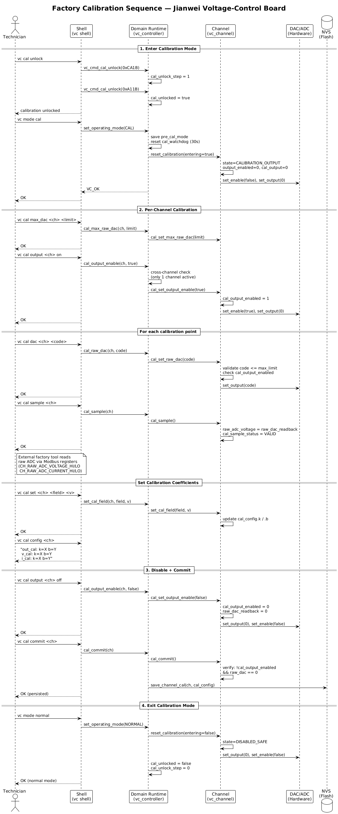

# Factory Calibration Guide — Jianwei Voltage-Control Board

## Overview

This guide describes the shell command sequence for factory calibration of a Jianwei voltage-control board channel. Calibration computes linear coefficients `y = x * k/10000 + b` per measurement axis (output, voltage measurement, current measurement) by collecting (DAC code, raw ADC reading) pairs and persisting them to NVS.

| Coefficient | Factory default | Description |
|-------------|----------------|-------------|
| `out_cal_k` / `out_cal_b` | k=32768, b=0 | Output DAC: raw_dac = target × k/10000 + b |
| `v_cal_k` / `v_cal_b` | k=10000, b=0 | Voltage measurement: measured = raw_adc × k/10000 + b |
| `i_cal_k` / `i_cal_b` | k=10000, b=0 | Current measurement: measured = raw_adc × k/10000 + b |

## Prerequisites

- Board powered and connected via serial console (USART3, 115200 8N1)
- Zephyr shell prompt available (`uart:~$`)
- Calibration fixture with calibrated external DMM (for coefficient computation outside firmware)
- Each channel calibrated independently; complete one before starting the next

## Procedure

### 1. Enter Calibration Mode

```
vc cal unlock
```

This single command performs the two-step unlock (0xCA1B → 0xA11B) and immediately enters calibration mode. A session guide is printed on success. An inactivity watchdog (default 300 s, configurable via `CONFIG_VC_CAL_WATCHDOG_TIMEOUT_S`) will auto-exit calibration mode if no commands are issued.

### 2. Per-Channel Calibration

Repeat the following for each channel that needs calibration.

The DAC ceiling (`CONFIG_VC_CAL_MAX_RAW_DAC`, default 65535) is a build-time
setting. If the calibration fixture imposes a voltage safety ceiling, set it in
the project Kconfig before flashing; it cannot be changed at runtime.

#### 2a. Enable Calibration Output

```
vc cal <ch> output on
```

The controller enforces that only one channel has calibration output active at a time. Command fails with error if another channel is still active.

#### 2b. Collect Calibration Points

For each DAC code the factory tool needs:

```
vc cal <ch> dac <code>    # set raw DAC output
vc cal <ch> sample        # capture ADC snapshot (blocking — prints dac/raw_v/raw_i)
```

`vc cal <ch> sample` blocks until the snapshot is ready and prints the raw values directly. The factory tool can also read raw ADC values via Modbus input registers (FC04). Channel 0 example:

| Register | Modbus Address (1-indexed) | 0-based Offset | Type |
|----------|---------------------------|----------------|------|
| `CH_RAW_ADC_VOLTAGE_HI` | 53 | ch_base + 12 | uint16 HI |
| `CH_RAW_ADC_VOLTAGE_LO` | 54 | ch_base + 13 | uint16 LO |
| `CH_RAW_ADC_CURRENT_HI` | 55 | ch_base + 14 | uint16 HI |
| `CH_RAW_ADC_CURRENT_LO` | 56 | ch_base + 15 | uint16 LO |

For channel `n`, the base is `40 + n × 40`. Add the offset to get the 0-based Modbus address; add 1 for the 1-indexed address used by `mbpoll`.

Collect minimum 2 pairs (DAC code, raw ADC) per axis for linear fit.

#### 2c. Write Calibration Coefficients

After the factory tool computes k and b from the collected pairs:

```
vc cal <ch> set out_cal_k <k>
vc cal <ch> set out_cal_b <b>
vc cal <ch> set v_cal_k   <k>
vc cal <ch> set v_cal_b   <b>
vc cal <ch> set i_cal_k   <k>
vc cal <ch> set i_cal_b   <b>
```

Verify with:

```
vc cal <ch> config
```

#### 2d. Disable Calibration Output

```
vc cal <ch> output off
```

**Required before commit.** The commit command is rejected while calibration output is enabled or the DAC code is non-zero.

#### 2e. Persist Coefficients

```
vc cal <ch> commit
```

Commits calibration coefficients to NVS flash. Only coefficients are stored; raw debug state and temporary output values are discarded.

### 3. Exit Calibration Mode

```
vc cal exit
```

Returns to the previous operating mode. All calibration state (`cal_unlocked`, DAC code, output enable) is cleared. Alternatively: `vc mode normal` or `vc mode auto`.

## Quick Reference

| Step | Command |
|------|---------|
| Unlock + enter cal mode | `vc cal unlock` |
| Session overview | `vc cal status` |
| Enable cal output | `vc cal <ch> output on` |
| Set DAC code | `vc cal <ch> dac <code>` |
| Capture ADC (blocking) | `vc cal <ch> sample` |
| Monitor raw DAC/ADC | `vc cal watch [<ch>] [<interval_ms>]` |
| Set coefficient | `vc cal <ch> set <field> <value>` |
| View coefficients | `vc cal <ch> config` |
| Disable cal output | `vc cal <ch> output off` |
| Commit to NVS | `vc cal <ch> commit` |
| Exit cal mode | `vc cal exit` |

**Coefficient fields:** `out_cal_k`, `out_cal_b`, `v_cal_k`, `v_cal_b`, `i_cal_k`, `i_cal_b`

## Safety Rules (Enforced by Firmware)

- Calibration mode requires two-step unlock before entry.
- Only one channel may have calibration output enabled at a time.
- Non-zero DAC code requires calibration output already enabled.
- Commit is rejected if output is enabled or DAC code is non-zero.
- Hard safety faults (hardware/interlock) block any non-zero calibration output.
- Inactivity watchdog (default 300 s) auto-exits calibration mode.
- Calibration mode is volatile and cannot persist across reboot.

## Sequence Diagram


