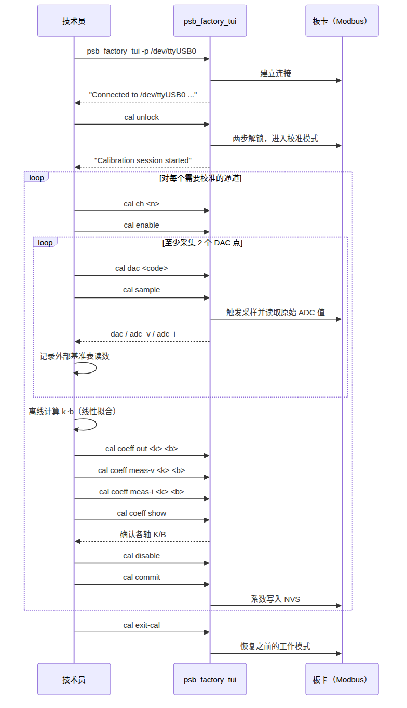
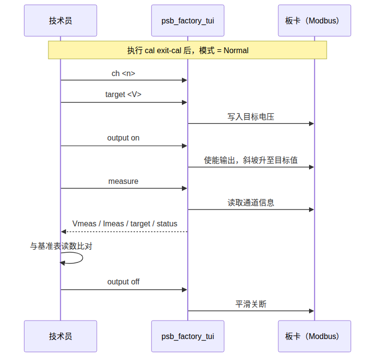

# 出厂校准指南 — psb_factory_tui

本指南面向使用 **工厂 TUI**（`psb_factory_tui`）对 Jianwei 高压控制板进行校准的
生产/技术人员，是快速上手参考。仓库中也有 Qt 工厂 GUI，但尚未达到发布状态——
请使用本文介绍的 TUI 工具。

*(English version: [calibration-guide.md](calibration-guide.md))*

---

## 1. 校准的作用

每个通道通过一对线性系数，在三条独立轴上把原始硬件码转换为物理量：
`y = x × k/D + b`。

| 轴 | 系数字段 | D | 含义 |
|---|---|---|---|
| 输出 | `out_cal_k` / `out_cal_b` | 10000 | `raw_dac = target × k/10000 + b` |
| 电压测量 | `v_cal_k` / `v_cal_b` | 1000000 | `measured_v = raw_adc_v × k/1000000 + b` |
| 电流测量 | `i_cal_k` / `i_cal_b` | 1000000 | `measured_i = raw_adc_i × k/1000000 + b` |

测量轴使用大得多的除数，因为它们要把一个很小、经过衰减的原始 ADC 读数
（增益约 0.001–0.01）缩小成物理量；这两条轴上无法表示 1.0 倍增益
（最大值仅为 65535/1000000 ≈ 0.0655）。输出轴增益接近 1，因此用较小的除数。
完整推导见 `docs/guide/parameter-reference.md`。

**出厂（未校准）默认值**——板卡出厂时即为这些值，你的任务是把它们替换为
真实的单板校准值：

| 字段 | 默认值 | 说明 |
|---|---|---|
| `out_cal_k` / `out_cal_b` | 32768 / 0 | 近似 1:1 的 DAC 增益，尚未校准 |
| `v_cal_k` / `v_cal_b` | 1 / 0（jw_hvb 板：2387 / 0） | 校准前刻意设为接近零 |
| `i_cal_k` / `i_cal_b` | 1 / 0（jw_hvb 板：14901 / 0） | 校准前刻意设为接近零 |

---

## 2. 所需准备

- 板卡已上电，并通过 USB 转串口 Modbus RTU 适配器连接（例如
  `/dev/ttyUSB0`，115200 8N1，从站地址 1——均为默认值）。
- 已编译好的 `psb_factory_tui`（见第 3 节）。
- 一台经过校准的外部基准表：电压轴用高精度万用表（DMM），电流轴用基准
  电流源或精密负载。板卡自身的 ADC 读数正是被校准的对象，不能作为基准。
- 一次只校准一个通道；固件本身也只允许同一时刻只有一个通道的校准输出
  处于使能状态。

---

## 3. 编译与启动

```bash
cmake -S tools -B tools/build       # BUILD_FACTORY 默认已开启
cmake --build tools/build --target psb_factory_tui -j
tools/bin/psb_factory_tui -p /dev/ttyUSB0
```

```
Usage: psb_factory_tui -p <port> [-b <baud>] [-i <slaveId>]
  -p, --port   串口设备（必填，如 /dev/ttyUSB0）
  -b, --baud   波特率（默认 115200）
  -i, --id     Modbus 从站地址（默认 1）
```

连接只在启动时建立一次。工具内部没有 `connect` 命令——如果端口或接线不对，
请先修复再重新启动。退出会话输入 `exit`（或 `quit`）；同样没有
`disconnect` 命令，因为一旦连接断开，REPL 内部无法重新连接。

---

## 4. 命令参考

以下命令均在启动后的 `factory>` 提示符下使用。

### 根级命令（任意工作模式下均可用）

| 命令 | 作用 |
|---|---|
| `info` | 协议/固件/型号/模式/运行时间概览 |
| `ch <n>` | 选择当前通道（下方所有按通道操作的命令共用该选择） |
| `target <V>` | 设置当前通道的目标电压 |
| `output on\|off\|immed\|zero` | 使能 / 平滑关断 / 立即关断 / 强制置零 |
| `fault clear\|clear-history` | 清除当前故障阻断 / 清除故障历史 |
| `measure` | 读取当前通道的 Vmeas、Imeas、目标值、状态 |
| `sys status` | 模式 + 各通道单行概览 |
| `sys mode normal\|auto` | 设置工作模式 |
| `sys save` / `sys load` | 将全部配置（运行参数 + 校准）保存到 / 从 NVS 加载 |
| `sys factory-reset` | 将全部配置重置为固件默认值 |
| `sys reset` | 对板卡执行软件复位，随后断开连接 |

### 校准子菜单（`cal ...`，需先解锁）

| 命令 | 作用 |
|---|---|
| `cal unlock` | 两步解锁并进入校准模式（原子操作） |
| `cal ch <n>` | 选择当前通道（与根级 `ch` 共用同一选择） |
| `cal enable` / `cal disable` | 使能校准输出 / 禁用并将 DAC 清零 |
| `cal dac <code>` | 写入原始 DAC 码（0–65535，若受限于夹具可能更低） |
| `cal sample` | 触发一次采样，打印 `dac` / `adc_v` / `adc_i` |
| `cal read` | 打印上一次采样快照，不触发新采样 |
| `cal coeff out\|meas-v\|meas-i <k> <b>` | 写入一组系数 |
| `cal coeff show` | 打印当前通道的系数 |
| `cal commit` | 将当前通道的系数持久化到 NVS |
| `cal status` | 模式 + 各通道输出/DAC/ADC 概览 |
| `cal safe` | 禁用**所有**通道的校准输出并将 DAC 清零 |
| `cal watch adc\|measure\|status\|all [interval]` | 实时刷新监控；按任意键停止 |
| `cal exit-cal` | 退出校准模式，恢复进入前的工作模式 |

---

## 5. 校准流程走查



1. **解锁**：`cal unlock` —— 两步解锁与进入校准模式作为一条原子命令执行，
   成功后会打印一份简要的会话内命令提示。
2. **逐通道**重复以下步骤：
   - `cal ch <n>` 选择通道，`cal enable` 使能输出。
   - 至少采集两个 DAC 点（点数越多拟合越好）：`cal dac <code>`，然后
     `cal sample` 触发并打印原始读数；每次采样同时记录外部基准表的读数。
   - 按轴离线计算 `k` 和 `b`（电子表格或脚本——见第 6 节）。
   - 写回系数：`cal coeff out <k> <b>`、`cal coeff meas-v <k> <b>`、
     `cal coeff meas-i <k> <b>`，用 `cal coeff show` 确认。
   - `cal disable`（提交前必须执行——输出使能或 DAC 非零时提交会被拒绝），
     然后 `cal commit`。
3. **退出**：`cal exit-cal` 恢复进入校准模式之前的工作模式。

---

## 6. 计算 k 和 b 的示例

三条轴使用同一套两点线性拟合。给定两组 `(x, y)`，其中 `x` 是工具打印的
原始值，`y` 是你的基准读数（换算成寄存器的原始单位）：

```
k = D × (y2 − y1) / (x2 − x1)
b = y1 − x1 × k / D
```

写回前把 `k`、`b` 四舍五入为整数（`k` 是 `uint16_t`，`b` 是 `int16_t`）。

**输出轴示例**（`x` = 下发的 DAC 码，`y` = DMM 测得的输出电压，换算为
0.1 V/LSB 的原始目标单位）：

| 点 | DAC 码 (x) | DMM 读数 | y（原始，×0.1 V） |
|---|---|---|---|
| 1 | 32768 | 995.0 V | 9950 |
| 2 | 49152 | 1490.0 V | 14900 |

```
k = 10000 × (49152 − 32768) / (14900 − 9950) = 10000 × 16384 / 4950 ≈ 33108
b = 32768 − 9950 × 33108 / 10000 ≈ −174
```

→ `cal coeff out 33108 -174`

**电压测量轴示例**（`x` = `cal sample` 打印的 `adc_v`，`y` 为与上面相同的
DMM 读数，原始单位）：

| 点 | adc_v (x) | y（原始，×0.1 V） |
|---|---|---|
| 1 | 4,140,000 | 9950 |
| 2 | 6,205,000 | 14900 |

```
k = 1000000 × (14900 − 9950) / (6205000 − 4140000) ≈ 2397
b = 9950 − 4140000 × 2397 / 1000000 ≈ 26
```

→ `cal coeff meas-v 2397 26`

**电流测量轴示例**（`x` = `cal sample` 打印的 `adc_i`，`y` 为基准电流源
读数，原始单位为 0.1 nA/LSB）：

| 点 | adc_i (x) | 基准值 | y（原始，×0.1 nA） |
|---|---|---|---|
| 1 | 335,000 | 500.0 nA | 5000 |
| 2 | 1,342,000 | 2000.0 nA | 20000 |

```
k = 1000000 × (20000 − 5000) / (1342000 − 335000) ≈ 14896
b = 5000 − 335000 × 14896 / 1000000 ≈ 10
```

→ `cal coeff meas-i 14896 10`

**以上数字仅为示例**——请替换为你的夹具实际的 `cal sample` 输出和基准表
读数。注意拟合出的 `k` 值都很接近 jw_hvb 板的出厂默认值（2387、14901）——
这是正常现象：一块状态良好的板卡只需要小幅修正，而不是完全不同的增益。

---

## 7. 校准后验证

提交并退出校准模式后，可用根级命令（无需解锁）验证结果：



```
factory> ch 0
factory> target 500.0
factory> output on
factory> measure
CH0:
  Vmeas:  499.8 V  (raw=4998)
  Imeas:  0.012 uA  (raw=120)
  Target: 500.0 V
  Status: 0x0003 [ON]
factory> output off
```

在整个工作范围内多取几个点，与基准表读数比对——不要只用拟合时用过的两个
点，这样才能确认修正在全量程范围内都成立，而不仅在校准点上成立。

---

## 8. 持久化

| 命令 | 作用范围 | 效果 |
|---|---|---|
| `cal commit` | 仅当前通道的校准配置 | 将该通道的系数保存到 NVS |
| `sys save` | 所有通道，运行参数 + 校准 | 把 RAM 中的全部配置保存到 NVS |
| `sys load` | 所有通道，运行参数 + 校准 | 从 NVS 重新加载（从未保存过的部分为空操作） |
| `sys factory-reset` | 所有通道 + 系统 | 清空 NVS，全部恢复为固件默认值 |

`cal commit` 只持久化校准系数，不涉及运行参数（目标电压、斜坡速率、电流
限制等）。如果本次会话中还修改过这些参数，断开前请执行 `sys save`，
否则下次重启会丢失。

---

## 9. 安全规则（由固件强制，与所用工具无关）

- 进入校准模式需要两步解锁（`cal unlock` 会自动完成这两步）。
- 同一时刻只能有一个通道的校准输出处于使能状态——在另一通道仍处于
  使能状态时执行 `cal enable` 会失败。
- 非零 DAC 码要求校准输出已经处于使能状态。
- 输出仍处于使能状态，或 DAC 码非零时，`cal commit` 会被拒绝——请先
  执行 `cal disable`。
- 无论处于何种模式，硬件/联锁故障都会阻止任何非零的校准输出。
- 空闲看门狗（默认 300 秒，`CONFIG_VC_CAL_WATCHDOG_TIMEOUT_S`）会在长时间
  未收到 `cal` 命令时自动退出校准模式——任何 `cal` 命令（包括
  `cal watch`）都会重置计时器。
- 校准模式是易失的，重启后不会保留；上电后始终从 Normal 或 Automatic
  模式开始。

---

## 10. 故障排查

| 现象 | 原因 / 处理方法 |
|---|---|
| `Error: not connected` | 工具启动时连接失败。检查 `-p`/`-b`/`-i` 参数后重新启动——会话内无法重连。 |
| `Error: no active channel (use 'cal ch <n>')` | 执行任何按通道操作前，先运行 `ch <n>`（或 `cal ch <n>`）。 |
| `cal enable` 失败 | 另一通道的校准输出仍处于使能状态——对其执行 `cal disable`，或用 `cal safe` 清除所有通道。 |
| `cal commit` 失败 | 输出仍使能，或 DAC 码非零——先执行 `cal disable`。 |
| 校准模式自动退出 | 空闲看门狗触发（默认 300 秒无 `cal` 命令）——重新执行 `cal unlock`。 |
| `cal dac <code>` 在某个值以上被拒绝 | 触发了固件编译时的 `CONFIG_VC_CAL_MAX_RAW_DAC` 上限（项目/夹具安全限制）——需查看固件编译配置，运行时无法调整。 |

---

## 速查表

```
tools/bin/psb_factory_tui -p /dev/ttyUSB0

cal unlock
  cal ch <n>
  cal enable
    cal dac <code>
    cal sample                       # 重复采集 >= 2 个点
  cal coeff out     <k> <b>
  cal coeff meas-v   <k> <b>
  cal coeff meas-i   <k> <b>
  cal coeff show
  cal disable
  cal commit
cal exit-cal

ch <n>
target <V>
output on
measure
output off
```
