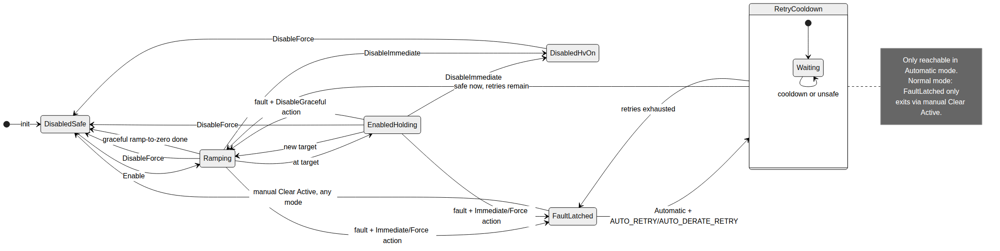
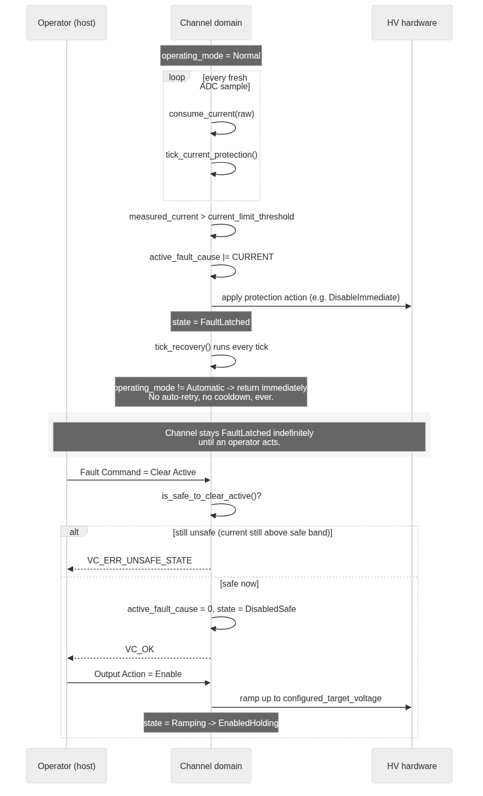
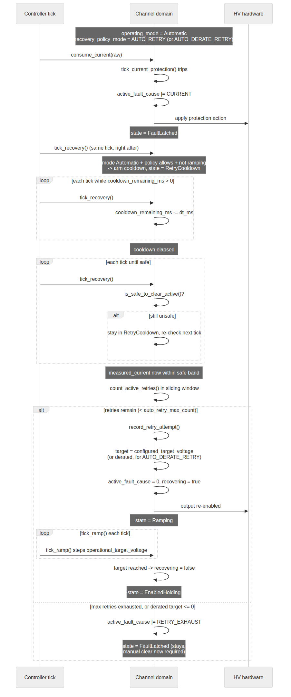

# Operating Mode Guide — Normal vs. Automatic

This guide covers `operating_mode`'s two supervised-operation states — **Normal**
and **Automatic** — with a focus on how current protection and recovery policy
behave differently in each. **Calibration mode is out of scope**; it's a
separate, exclusive maintenance state covered in `docs/guide/calibration-guide.md`.

Related references: `docs/guide/parameter-reference.md` (field-by-field
defaults and units), `docs/guide/modbus-reference.md` (register addresses),
`docs/guide/shell-reference.md` (shell command syntax).

---

## 1. The two modes, in one sentence each

- **Normal** — the channel does exactly what it's told, and nothing more. A
  fault always latches and stays latched until an operator explicitly clears
  it. No autonomous behavior of any kind.
- **Automatic** — the channel still requires an operator to configure it, but
  once configured it can autonomously re-enable itself after a fault, if
  `recovery_policy_mode` says it should.

Everything else — ramping, calibration application, the current-limit trip
condition itself — behaves identically in both modes. The only thing
`operating_mode` changes is **whether a fault is allowed to clear itself**.

---

## 2. What actually happens when you switch modes

`vc_controller_set_operating_mode()` (`lib/voltage_control/vc_controller.c`)
does two things beyond just recording the new mode:

| Transition | Side effect |
|---|---|
| Automatic → Normal | Every channel gets `DisableGraceful` — outputs ramp down to zero and turn off. Automatic mode never leaves an output silently running once you step back to Normal. |
| → Automatic | Every channel with a non-zero `configured_target_voltage` **and no active fault** is auto-enabled and starts ramping toward its target. Faulted channels are skipped — the mode switch does not touch them. |
| → Normal (from Automatic) or plain re-entry | No auto-enable. In Normal mode you always explicitly send `Output Action = Enable` yourself. |

Note the asymmetry already built into `→ Automatic`: it **skips** faulted
channels rather than rejecting the whole mode switch. Section 6 below
discusses why that specific design choice creates a real gap, and a proposal
to close it.

---

## 3. Current protection — the trip condition (same in both modes)

Protection is armed per channel via three fields, all part of
`vc_channel_config`:

| Field | Meaning |
|---|---|
| `current_protection_mode` | `DISABLED` \| `FLAG_ONLY` \| `APPLY_OUTPUT_ACTION` |
| `current_protection_output_action` | What to do when it fires, if mode is `APPLY_OUTPUT_ACTION`: `DISABLE_GRACEFUL` \| `DISABLE_IMMEDIATE` \| `DISABLE_FORCE` |
| `current_limit_threshold` | Trip point, ×0.1 nA (default 10000 = 1000 nA) |

The trip condition itself has **no hysteresis**:

```c
if (measured_current > current_limit_threshold) { /* fault fires */ }
```

`current_safe_band_pct` is a completely separate concept — it never affects
*whether* a fault trips, only whether the channel is currently considered
*safe enough to clear*:

```c
safe_to_clear = measured_current <= current_limit_threshold × (100 − current_safe_band_pct) / 100
```

Both `FLAG_ONLY` and `APPLY_OUTPUT_ACTION` record the trip in
`fault_history_cause`. Only `APPLY_OUTPUT_ACTION` also sets
`active_fault_cause` and actually disables the output — `FLAG_ONLY` is
observation-only by design.

**Evaluation is sample-driven, never write-driven.** Protection is checked
exactly once — inside `vc_channel_consume_current()`, whenever a fresh
current sample arrives. It is *not* re-evaluated when you write
`current_protection_mode`, `..._output_action`, or `..._threshold`. This
matters because those three fields arrive as three separate Modbus register
writes: if protection re-evaluated on every individual write, an
in-flight reconfiguration could trip against a stale, half-updated
combination. Config writes now always land as a complete, consistent set
before the next evaluation happens.

---

## 4. Recovery policy — what differs between Normal and Automatic

`recovery_policy_mode` (per channel) only has an effect **in Automatic
mode**. In Normal mode, every fault latches and stays latched, full stop,
regardless of this setting.

| Policy | Normal mode | Automatic mode |
|---|---|---|
| `MANUAL_LATCH` (default) | Latches; manual clear required | Latches; manual clear required (identical to Normal) |
| `NEVER_RETRY` | Latches; manual clear required | Same as `MANUAL_LATCH` in this implementation |
| `AUTO_RETRY` | Latches; manual clear required | After `auto_retry_delay` seconds *and* once `measured_current` is back within the safe band, clears the fault and ramps back to `configured_target_voltage` |
| `AUTO_DERATE_RETRY` | Latches; manual clear required | Same as `AUTO_RETRY`, but each retry targets `configured_target_voltage − (attempt_number × auto_derate_step)`. Reaching zero or below exhausts immediately instead of retrying at an invalid target |

Only `VC_FAULT_CURRENT` is ever auto-recoverable. Hardware, interlock,
measurement, and stale-data faults always require a manual clear in *both*
modes — there is only ever a "safe now?" check for current faults (the
current safe-band), so nothing else has a defined condition under which
auto-retry could safely proceed.

**Retry accounting** uses a sliding window, not a simple counter:

- Each retry attempt is timestamped. Attempts older than `auto_retry_window`
  seconds age out and stop counting.
- If the next retry would exceed `auto_retry_max_count` attempts still inside
  the window, the channel latches with `VC_FAULT_RETRY_EXHAUST` added to the
  fault cause — this combination specifically means *"auto-retry gave up,"*
  not *"still faulted, a retry is still coming."*
- Because the window ages out on its own, `auto_retry_count` naturally
  returns to 0 if the channel runs cleanly for longer than the window —
  there's no separate "reset" action needed.

---

## 5. Channel state machine



The states relevant to Normal/Automatic operation (Calibration's own state is
omitted — it's a separate, exclusive mode entered only via the calibration
unlock sequence):

- **DisabledSafe** — output off, DAC commanded to 0, hardware fully
  de-energized. Entry state after init, after `DisableForce`, and after a
  graceful ramp-to-zero completes.
- **DisabledHvOn** — output off but the HV stage's hardware enable is left
  on, commanding 0 V. Entered by `DisableImmediate` — a faster stop than
  graceful, but not a full hardware cutoff like `DisableForce`.
- **Ramping** — output enabled, `operational_target_voltage` moving toward a
  target. This single state covers three distinct intents: ramping up to a
  newly configured target, ramping down to zero for a graceful disable, and
  ramping to a (possibly derated) target during an automatic retry.
- **EnabledHolding** — output enabled, steady at target.
- **FaultLatched** — `active_fault_cause` is set. The only ways out are a
  manual Clear Active command, or (Automatic mode only) the recovery flow.
- **RetryCooldown** — waiting for `auto_retry_delay` to elapse and the
  current safe-band condition to be met before attempting a retry. **Only
  reachable in Automatic mode** — this is the one state Normal mode never
  enters.

---

## 6. Fault handling walkthrough

### Normal mode: fault always requires a manual clear



The `tick_recovery()` step (`lib/voltage_control/vc_channel.c`) checks the
current operating mode first, before anything else. In Normal mode, that
check fails immediately and the function returns — no cooldown state is ever
entered, no retry is ever attempted, regardless of what
`recovery_policy_mode` is configured to. The channel sits in `FaultLatched`
until an operator sends `Fault Command = Clear Active` (rejected if still
unsafe) followed by `Output Action = Enable`.

### Automatic mode: `AUTO_RETRY` / `AUTO_DERATE_RETRY` can self-heal



Same trip, same `FaultLatched` entry — but on the very next
`tick_recovery()` call, the mode check now passes. The channel moves into
`RetryCooldown`, counts down `auto_retry_delay`, then polls the safe-band
condition every tick until it's satisfied. Once safe, it checks the sliding
window: if a retry slot remains, it clears the fault, computes the (possibly
derated) target, and re-enables — driven by the *same* `vc_channel_tick_ramp()`
machinery as any other enable, so a recovery is a normal graceful ramp-up,
not an instant jump. If no slot remains, it latches with
`VC_FAULT_RETRY_EXHAUST` instead, and stays there — Automatic mode does not
retry forever.

---

## 7. Known gap, and the fix (implemented)

The design intent (`docs/superpowers/specs/2026-06-15-voltage-control-domain-behavior.md`)
states automatic recovery should apply *"only to faults detected while
Automatic Mode is already active"* — a fault that latched in Normal mode
should not become retryable just because the system later switches to
Automatic.

**The current implementation doesn't make that distinction.**
`tick_recovery()`'s mode gate checks only the *current* operating mode on
each tick, not the mode that was active when the fault was first detected.
Combined with `→ Automatic`'s behavior of skipping (not rejecting) faulted
channels on mode entry (Section 2), the actual sequence today is:

1. Channel faults in Normal mode → latches, as expected.
2. Operator switches the whole system to Automatic (for unrelated reasons —
   e.g. bringing up other channels).
3. The faulted channel is silently now eligible for `AUTO_RETRY` /
   `AUTO_DERATE_RETRY`, even though the fault predates Automatic mode
   entirely.

### The proposal: block Normal ↔ Automatic transitions while any channel is faulted

You asked whether disallowing mode switches (Normal/Automatic, excluding
Calibration) while any channel is in a fault state — requiring manual
intervention first — conflicts with the existing spec, and for my opinion.

**Yes, it directly conflicts with the spec text as written today.** The same
spec section says: *"Existing Active Fault Blocks do not become retryable
just because the mode changes to Automatic"* — which is only meaningful if
the mode change is *allowed to happen* while faulted; it's explicitly
describing and permitting that scenario, then clarifying the existing fault
doesn't retroactively benefit from it. Blocking the transition outright
supersedes that clause rather than implementing it. That's not
disqualifying — the spec already has a known gap here, so revising it is the
natural next step — but it is a real, direct conflict with the current text,
worth calling out explicitly rather than glossing over.

**My opinion: the idea is right, but I'd narrow it to one direction.** A
strict bidirectional block — reject *any* Normal↔Automatic switch while any
channel is faulted — has a real downside: it also blocks Automatic → Normal,
which is exactly the *"retreat to the safer, fully-supervised mode"* move an
operator would want to make **because** something just faulted. Normal mode
is intentionally the more conservative state (nothing happens without an
explicit command); trapping an operator in Automatic mode until they clear a
fault first seems backwards from a safety standpoint.

I'd implement it as: **block Normal → Automatic while any channel has an
active fault; always allow transitions into Normal regardless of fault
state.** This closes the exact gap above — a Normal-mode fault can never
"ride along" into Automatic eligibility, because you can't enter Automatic
while it's still active — while preserving the ability to retreat to Normal
at any time. It's also considerably simpler to implement than the
alternative I'd originally scoped (threading a mode-transition timestamp
through `vc_channel_consume_current()` and comparing it against
`last_fault_timestamp`): a single check at the top of
`vc_controller_set_operating_mode()`, no new state, no signature changes.

```c
if (mode == VC_OPERATING_MODE_AUTOMATIC &&
    ctrl->operating_mode == VC_OPERATING_MODE_NORMAL) {
    for (size_t i = 0; i < ctrl->channel_count; i++) {
        if (ctrl->channels[i].active_fault_cause != 0) {
            return VC_ERR_UNSAFE_STATE;
        }
    }
}
```

One secondary consideration worth flagging: this check is system-wide (any
one faulted channel blocks the whole board's transition), while
`recovery_policy_mode` itself is per-channel. On this 2-channel HVB variant
that's a minor concern; on a future 16-channel LVB variant, one faulted
channel blocking Automatic entry for fifteen healthy ones is a more visible
tradeoff worth a deliberate decision, not an accident of implementation. This
was implemented as-is (system-wide), matching the recommendation above — if
the LVB variant needs per-channel granularity instead, that's a deliberate
follow-up decision, not something this change silently precluded.

**Implemented** in `vc_controller_set_operating_mode()`
(`lib/voltage_control/vc_controller.c`), guarded by three new tests in
`tests/voltage_control/vc_controller/src/main.c`:
`test_normal_to_automatic_rejected_when_channel_faulted`,
`test_normal_to_automatic_allowed_when_no_channel_faulted`, and
`test_automatic_to_normal_allowed_when_channel_faulted`. No existing test
exercised "switch to Automatic while a channel is already faulted and expect
`VC_OK`," so this was additive — nothing already committed changed
behavior.
